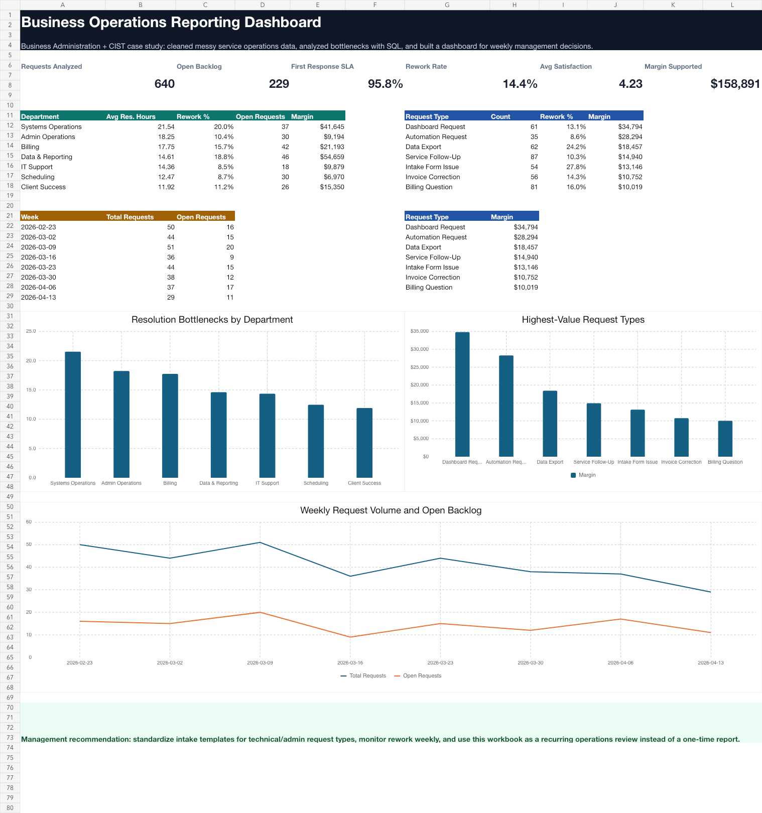

# Business Operations Reporting & Automation System

Portfolio project for Business Administration + CIST positioning.

## 30-Second Summary

I built a repeatable reporting system that takes messy business operations data, cleans it with Python, analyzes it with SQL, and produces dashboard-ready outputs for weekly management decisions.

This project shows practical business systems ability: not just charts, but a workflow that helps an operations manager understand backlog, response speed, rework, satisfaction, margin, and where automation should be prioritized.

## Visual Proof



Additional dashboard evidence:

- [KPI summary preview](assets/screenshots/kpi_summary_excel_preview.png)
- [Department bottlenecks preview](assets/screenshots/department_bottlenecks_excel_preview.png)
- [Request type ROI preview](assets/screenshots/request_type_roi_excel_preview.png)
- [Weekly metrics preview](assets/screenshots/weekly_metrics_excel_preview.png)

Open the generated outputs:

- [Portfolio showcase](reports/portfolio_showcase.html)
- [Operations dashboard](reports/operations_dashboard.html)
- [Excel dashboard workbook](reports/business_operations_reporting_dashboard.xlsx)
- [Executive summary](reports/executive_summary.md)

## Key Results

- 658 raw records generated
- 640 clean records after deduplication
- 95.8% first-response SLA performance
- 98.8% resolution SLA performance
- 14.4% rework rate
- 229 open requests identified
- $264,625 revenue supported
- $158,891 estimated margin supported
- Systems Operations identified as the largest resolution bottleneck
- Dashboard Requests identified as the highest-value request type

## Business Scenario

A service-based organization receives requests through email, web forms, phone calls, referrals, and walk-ins. The team tracks the work in spreadsheets, but the data is inconsistent and hard to use.

The raw dataset includes realistic business data problems:

- Duplicate request IDs
- Inconsistent labels and categories
- Mixed date formats
- Missing response and resolution fields
- Invalid numeric values
- No clear KPI layer
- No weekly reporting workflow

## What I Built

The system creates a clean, repeatable reporting flow:

1. Generates a realistic messy operations dataset.
2. Cleans and standardizes the data with Python.
3. Deduplicates request records.
4. Creates KPI fields for SLA performance, backlog, rework, satisfaction, revenue supported, and estimated margin.
5. Loads the cleaned data into SQLite.
6. Runs SQL queries for weekly, department, channel, and request-type performance.
7. Exports dashboard-ready CSV files.
8. Generates an HTML dashboard, Excel workbook dashboard, screenshot previews, and executive summary.

## Skills Demonstrated

- Python data cleaning
- SQL analysis
- SQLite database workflow
- CSV reporting outputs
- KPI design
- Dashboard creation
- Excel workbook reporting
- Business operations analysis
- Process improvement
- CIST systems thinking
- Client-ready communication

## Project Structure

```text
business_operations_reporting_system/
  README.md
  case_study.md
  src/
    build_case_study.py
  data/
    raw/
      business_operations_raw.csv
    processed/
      clean_operations_requests.csv
      operations_reporting.sqlite
      kpi_summary.csv
      weekly_metrics.csv
      department_bottlenecks.csv
      channel_performance.csv
      request_type_roi.csv
  sql/
    analysis_queries.sql
  reports/
    portfolio_showcase.html
    operations_dashboard.html
    business_operations_reporting_dashboard.xlsx
    executive_summary.md
  assets/
    screenshots/
      dashboard_excel_preview.png
      kpi_summary_excel_preview.png
      department_bottlenecks_excel_preview.png
      request_type_roi_excel_preview.png
      weekly_metrics_excel_preview.png
  requirements.txt
```

## How To Run

From this project folder:

```bash
python3 src/build_case_study.py
```

Then open:

```text
reports/portfolio_showcase.html
reports/operations_dashboard.html
reports/business_operations_reporting_dashboard.xlsx
reports/executive_summary.md
```

## Portfolio Pitch

This project shows how I combine business administration and information systems thinking. I can take messy operational data, structure it into a reliable reporting process, and communicate the results in a way that supports business decisions.

The same workflow can be adapted for small businesses, campus departments, clinics, service teams, agencies, student organizations, and startup operations teams.

## Freelance Services This Supports

- Excel/CSV cleanup
- Dashboard creation
- Excel workbook reporting
- KPI reporting
- SQL reporting
- Weekly operations reports
- Admin workflow automation
- Business process analysis
- AI-assisted reporting workflows

## Next Improvements

- Add a Power BI version of the dashboard.
- Add a short video walkthrough.
- Create a second case study using real public business data.
